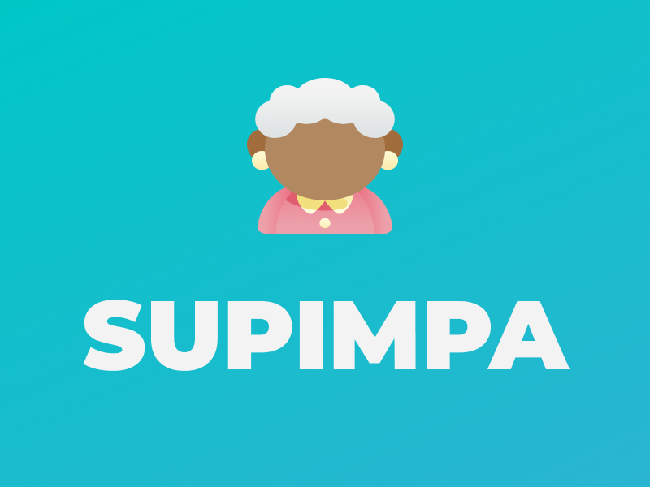

<h1 align="center">
  
</h1>

## Projeto

Supimpa é uma aplicação para cadastrar casas de repouso e centro de convivência para idosos.

## Demonstração

- [Vídeo da aplicação Web](https://www.youtube.com/watch?v=smu-UUQzPcg)
- [Vídeo da aplicação Mobile](https://www.youtube.com/watch?v=3ghvL0H5s34)

## Layout

Nos links abaixo você encontra o layout do projeto web e também do projeto mobile. Para visualizar, é preciso ter uma conta no [Figma](http://figma.com);

- [Layout Web]()
- [Layout Mobile]()

## Tecnologias

Esse projeto foi desenvolvido com as seguintes tecnologias:

- [Node.js](https://nodejs.org/en/)
- [React](https://reactjs.org)
- [React Native](https://facebook.github.io/react-native/)
- [Expo](https://expo.io/)
- [TypeScript](https://www.typescriptlang.org/)

Back-end desenvolvido em Node.js.

Front-end desenvolvido em React.

Mobile desenvolvido em React Native.

Para mais informações sobre as ferramentas utilizadas, acesse os seguintes repositórios:

- [Back-end](https://github.com/gmcotta/supimpa-api)
- [Front-end](https://github.com/gmcotta/supimpa-web)
- [Mobile](https://github.com/gmcotta/supimpa-mobile)
